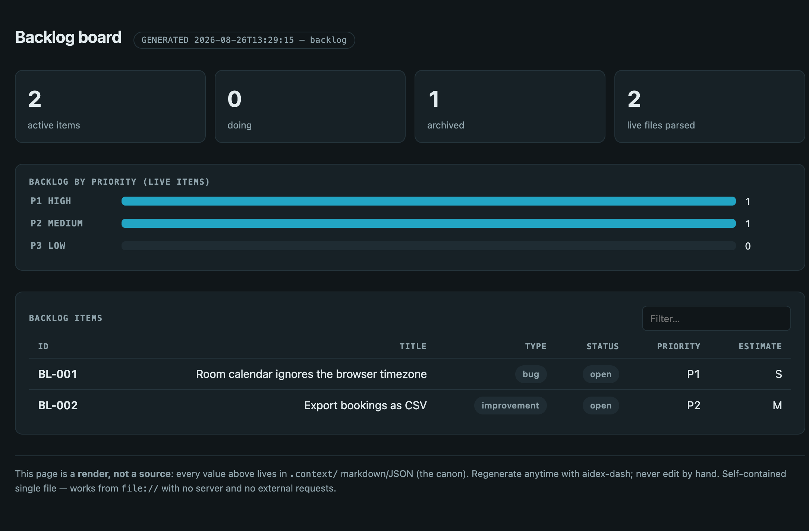

# aidex

> Keep your Claude Code ecosystem lean and consistent — skills, docs, and project context from one source of truth.

[](LICENSE)
[](.claude-plugin/plugin.json)
[](https://docs.anthropic.com/en/docs/claude-code)

AI coding assistants reload their context every session. As your setup grows, skills get copy-pasted across projects and drift out of sync, every project organizes its `.context/` knowledge differently, and idle context quietly eats your token budget. **aidex** fixes that with a single-source skill store that ships as one Claude Code plugin, a standard `.context/` convention, and an auditor that flags bloat, broken symlinks, and stale docs before they cost you.

Built for [Claude Code](https://docs.anthropic.com/en/docs/claude-code), but the architecture is tool-agnostic.

## Quick start

```
/plugin marketplace add yacb2/aidex
/plugin install aidex
```

Then restart Claude Code. In any project, just ask naturally — the right skill loads itself:

- *"Create a plan for the auth migration"* → scaffolds `.context/plans/…` with phases + checkboxes
- *"Audit my project's health"* → runs parallel auditors, returns a health score + suggested fixes
- *"/aidex:audit new ux login-redesign"* → scaffolds a UX audit with a methodology playbook
- *"/aidex:aidex init"* → bootstraps the `.context/` skeleton in a project that doesn't have one yet
- *"Render the backlog as an HTML board"* → `artifact` generates a sortable, self-contained page

## What this solves

AI coding assistants load context into every session. As your tooling grows, you end up with:

- **Noise**: Stack-specific skills loading in every project
- **No organization**: No way to know which skills exist or when they were last updated
- **Duplication**: Same skill copied across projects, drifting out of sync
- **No project context structure**: Each project organizes its knowledge differently

aidex solves this with two pillars:

1. **Centralized assistant configuration** — Skills managed from a single source, shipped as one plugin
2. **Structured project context** — A `.context/` convention for organizing project knowledge

## Architecture

### Pillar 1: Assistant Configuration (one plugin + per-project overrides)

The suite ships as a single Claude Code plugin. `.claude-plugin/plugin.json` declares it,
`.claude-plugin/marketplace.json` makes the repo its own marketplace, `skills/` holds the
19 skills — invoked `/aidex:<name>` — and `hooks/hooks.json` wires the four shipped hooks
automatically when the plugin is installed. Nothing is copied into `~/.claude/` and nothing
is symlinked: symlinked skills and rules were the loader path with three separate bugs
(Claude Code 2.0.62, 2.1.198, 2.1.239), and a plugin has neither problem.

```
aidex/                                   <-- the plugin, as Claude Code loads it
├── .claude-plugin/
│   ├── plugin.json                      <-- name, version, description, repository
│   └── marketplace.json                 <-- the repo as its own marketplace
├── skills/                              <-- invoked /aidex:<name>
│   ├── aidex/                           <-- the orchestrator
│   ├── conventions/                     <-- canon hub, non-invocable
│   ├── plan/
│   ├── decision/
│   ├── request/
│   ├── research/
│   ├── reference/
│   ├── skill/
│   ├── audit/
│   ├── backlog/
│   ├── loop/
│   ├── comm/
│   ├── plan-exec/
│   ├── bugfix/
│   ├── workflow/
│   ├── worktree/
│   ├── artifact/
│   ├── review/
│   └── coverage/
├── hooks/
│   └── hooks.json                       <-- wires the four shipped hooks on install
└── docs/retired/                        <-- the pre-plugin installer and rules/, for the record

project/.claude/skills/                  <-- your own project-specific skills (real files)
└── local-only-skill/SKILL.md
```

| Scope | Location | Loaded in | Use for |
|-------|----------|-----------|---------|
| **Plugin** | `aidex` (installed via `/plugin`) | All projects | The 19 suite skills + the 4 hooks |
| **Local** | `project/.claude/skills/` | That project only | Project-specific skills of your own |
| **Per-project silencing** | `project/.claude/settings.local.json` `enabledPlugins` | That project only | Skills **provided by a plugin are exempt from `skillOverrides`**, at any key format — so aidex's skills cannot be silenced one by one. The only lever is `enabledPlugins: {"aidex@aidex": false}`, all-or-nothing for the whole plugin. `skillOverrides` (`name-only`, `user-invocable-only`, `off`) still applies to skills of your own. |

### Pillar 2: Structured Project Context (`.context/`)

A standard directory structure for project knowledge:

```
project/.context/
├── references/      # Internal technical documentation
├── docs/            # Library/dependency documentation
├── plans/           # Implementation plans with checkbox tracking
├── backlog/         # Pending work items, tech debt
├── research/        # Spikes, analysis, exploration
├── issues/          # Known bugs, pending decisions
├── requests/        # Incoming tasks and product requirements
├── decisions/       # Architecture/product decision records
├── audits/          # Project-state catalogs (INVENTORY + per-run folders)
├── loops/           # Agentic-loop specs (goal + verifiable gate + guardrails)
└── communications/  # Inbound/outbound comms log (received/ + sent/, native language)
```

A complete, validator-clean example lives in [`examples/.context/`](examples/.context/) — a fictional
booking app with a backlog, a modular plan, two ADRs (one superseding the other), a spike, a reference
module, a request and a UX audit, all cross-linked. Every board below is rendered from files like those,
at zero tokens, into a single self-contained HTML page:



## What's included

### Hooks

Four hooks ship wired by `hooks/hooks.json` and start working the moment the plugin is
installed: `memory-audit-nudge.sh` (SessionStart), `memory-save-gate.sh` and
`artifact-open-once.sh` (PreToolUse), and `context-depth-nudge.sh` (UserPromptSubmit).
The retired ones are kept in `hooks/` for the record; what each does and why lives in
`hooks/README.md`.

### Rules

The nine always-on rules aidex used to install into `~/.claude/rules/` are retired: a
plugin cannot ship always-on rules, and each one's canon now lives in the `conventions`
skill's `references/`, cited by the skills that need it (see
[`docs/retired/`](docs/retired/README.md)).

### 19 skills

| Skill | Type | What it does |
|-------|------|-------------|
| **`aidex`** | User-invoked + context-triggered | The orchestrator. Audits the Claude Code ecosystem — `.context/` (including `audits/`), skills, symlinks, MEMORY.md, plugins, and the session's idle context budget. Launches parallel subagents, reports findings, suggests and applies fixes. |
| **`conventions`** | Passive canon hub (non-invocable) | The canon. Full `.context/` and skill conventions that the invocable siblings below cite. Degraded to a non-invocable reference hub — it no longer auto-triggers; the siblings carry the triggers. |
| **`plan`** | User-invoked + context-triggered | Creates `.context/plans/` — multi-phase implementation plans with numbered files, phases, and checkbox tracking. A triage step routes small work to a **scoped plan** instead: one file, no phases, just the file list and acceptance criteria, gated on structure rather than on how the request was worded. |
| **`decision`** | User-invoked + context-triggered | Records `.context/decisions/` ADRs — what was chosen, why, the alternatives, and the consequences. |
| **`request`** | User-invoked + context-triggered | Captures incoming stakeholder/client requests into `.context/requests/` before anyone acts on them. |
| **`research`** | User-invoked + context-triggered | Investigation and spike notes into `.context/research/` before a plan or implementation. |
| **`reference`** | User-invoked + context-triggered | Evergreen how-it-works documentation into `.context/references/` (architecture, runbooks, configuration). |
| **`skill`** | User-invoked + context-triggered | Checks and structures a skill against this project's house skill conventions. |
| **`audit`** | User-invoked + context-triggered | Operates `.context/audits/`. Sub-actions: `/aidex:audit new <type> <slug>` · `/aidex:audit validate` · `/aidex:audit escalate <id>` · `/aidex:audit close <run>` · `/aidex:audit reindex` · `/aidex:audit migrate` · `/aidex:audit coverage-matrix` · `/aidex:audit coverage-sweep` · `/aidex:audit affected-tests`. Ships stock playbooks (ux, ai-opportunities, retest, security, perf, a11y, hitl, test-coverage, docs-coverage, rule-ablation). `affected-tests` also names any changed file that measurably breaks and has no E2E reaching it, before the change lands. |
| **`backlog`** | User-invoked + context-triggered | Creates consistent entries in `.context/backlog/` with origin tracking. Called by `/aidex:audit escalate` to close the audit→backlog loop. Also scores closed items' `estimate:` against the effort they actually cost — a read that gates nothing. |
| **`loop`** | User-invoked + context-triggered | Designs agentic loops — writes a `.context/loops/` loop-spec (goal + verifiable gate + state file + guardrails + engine), then hands off execution to native `/goal`, `/loop`, the ralph-loop plugin, or `claude -p`. Sub-actions: `/aidex:loop design` · `new` · `run`. |
| **`workflow`** | User-invoked + context-triggered | Designs one-shot multi-agent fan-out / decomposition orchestrations — writes a `.context/workflows/` spec (goal + fan-out shape + per-agent model table + gate policy) before the Workflow runs. |
| **`comm`** | User-invoked + context-triggered | Captures inbound/outbound communications into `.context/communications/{received,sent}/` — emails, WhatsApp, calls, meetings — with channel/direction/from/to front-matter. Body stays in the native language of the communication (exempt from English-only). |
| **`plan-exec`** | User-invoked + context-triggered | Executes a written multi-phase plan (typically a `.context/plans/` doc) phase-by-phase, enforcing between-phase discipline: code-review, commit, and handoff when context grows. Routes back to `plan` for plan creation. |
| **`review`** | User-invoked + context-triggered | Reviews code **as it stands** — a module, feature, path, or whole app — where every built-in instrument (`/code-review`, `/simplify`, `/security-review`) is anchored to a diff. Measures the target first (`resolve-review-target.sh`: files, LOC, security/perf surface, size class), proposes which finder angles are worth launching and what they cost, then fans out find→verify across four lenses (correctness · simplify · security · perf). An oversize target is refused **as a single pass** — a small-target finder count spread over a whole app produces a sample, and a sample reported as a review is the failure that check exists to stop — and `--partition` then emits the split to phase it: one part per immediate subdirectory, each measured as a target in its own right, the parts summing to the whole. The union of the phases is the coverage one sampled pass never had. |
| **`bugfix`** | User-invoked + context-triggered | Guided TDD bug fixing: investigate → write a RED regression test → fix → GREEN → commit test and fix together. Detects test runners from project config; stack-agnostic. |
| **`worktree`** | User-invoked + context-triggered | Creates and destroys fully isolated worktrees — one git worktree per participant repo, its own port slot, its own compose stack. The mechanism ships as `worktree.sh`; a project supplies only parameters in `.context/worktrees/config.env`. **One path, not tiers:** a worktree is born with its full stack always (`--no-infra` is the explicit code-only opt-out), because full isolation now costs ~25s to create and ~3s to tear down. `down` verifies nothing is left attributable to the slug, reports host processes it will not kill, and with `--delete-branch` removes the branch `new` created — via `git branch -d`, which refuses an unmerged branch. |
| **`coverage`** | Model-invocable | The stack-agnostic testing canon: which layer a behaviour belongs in, which tests to run for a change (the full suite is a boundary gate, never a per-phase one), when to extract a fixture, and the per-project `.context/testing-profile.md` that names the stack pack (Django, Vue, Playwright, Payload, Svelte) carrying the concrete test shapes and the `test-e2e.sh` generator. Deliberately does **not** run audits or touch `module-map.json` / `coverage-matrix.json` — that split belongs to `audit`'s `test-coverage` playbook. |
| **`artifact`** | User-invoked + context-triggered | Renders `.context/` boards as self-contained interactive HTML (backlog board, plan progress, audit inventory, coverage matrix) via deterministic scripts — ~0 recurring tokens; markdown stays canon, HTML is a regenerable sibling render. Never publishes unprompted; opens locally via `file://`, and can be published as a Claude Code Artifact only on explicit request. |

### How it works

**Creating things** — just ask naturally:
```
"Create a plan for the auth migration"
→ Claude loads plan, creates .context/plans/2026-04-02-auth-migration/
  with numbered files, phases, checkboxes, following all conventions

"Create a reference for the payment API"  
→ Claude loads reference, creates .context/references/payment-api/
  with 00-index.md + 01-overview.md

"/aidex:audit new ux login-redesign"
→ Scaffolds .context/audits/ux/2026-04-02-login-redesign/ with index, findings,
  and materializes that methodology's boards on first use —
  audits/ux/{00-inventory.md, 00-methodology.md (seeded from the ux playbook), 00-changelog.md}
```

**Auditing** — ask or invoke `/aidex:aidex`:
```
"Check my project's documentation health"
→ aidex launches parallel subagents:
  - context-auditor (haiku): checks .context/ structure
  - skills-auditor (haiku): checks skill frontmatter, structure
  - symlink-checker (haiku): verifies all symlinks
  - memory-auditor (haiku): checks MEMORY.md bloat
  - freshness-checker (sonnet): detects stale docs
  - plugin-auditor (haiku): flags unused plugin agents
  - context-cost-analyzer (haiku): attributes idle token cost

→ Reports findings with health score
→ Suggests fixes: "Want me to clean MEMORY.md? Archive old plans? Fix broken symlinks?"
→ Executes what you approve
```

## Install, update, uninstall

```
/plugin marketplace add yacb2/aidex
/plugin install aidex          # then restart Claude Code
/plugin update aidex           # restart to apply
/plugin uninstall aidex
```

The same verbs exist on the CLI (`claude plugin install|update|uninstall|list`), and
`claude plugin validate .` checks this repo's own manifests. The install diagnosis the
old `./install.sh --doctor` gave returns as a skill sub-action (BL-404); the retired
installer and its tests live in [`docs/retired/`](docs/retired/README.md).

Your own skills go in `project/.claude/skills/<name>/SKILL.md` for one project, or in a
plugin of your own for all of them — a plugin never touches either.

## License

MIT
